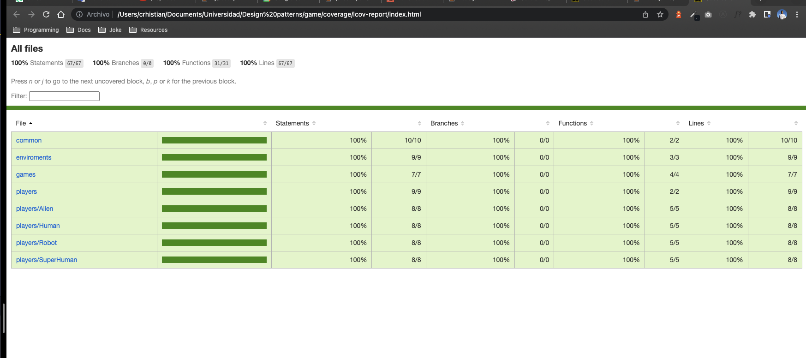

# League Game

## Configurations

Before start you should have some configurations setups.

- Execute with python and node each app or install docker.

## Starting  🚀

These instructions will allow you to get a copy of the project running on your local machine for development and testing purposes.

See **Deployment** to know how to deploy the project.

### Pre-requirements 📋

To use the project it is necessary to install Node .

### **List of commands**

- `npm run test`
- `npm run test:cov`

or

- `yarn test`
- `yarn test:cov`

after running `npm run test:cov` **coverage/** folder should be generated move to /coverage/lcov-report and open index.html if doesn't open automatically.
